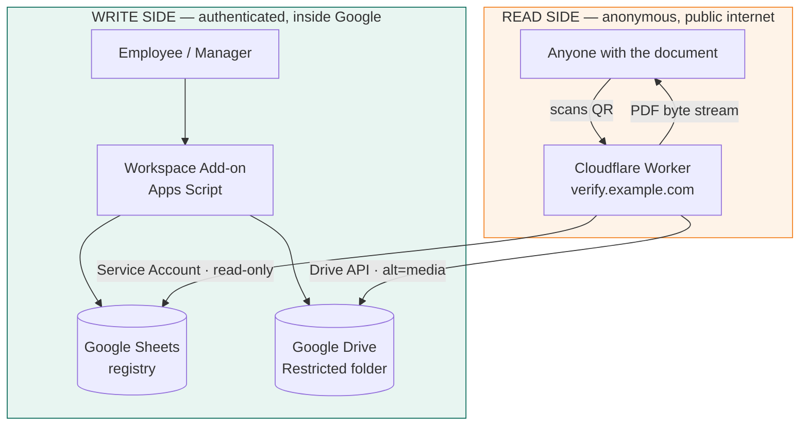
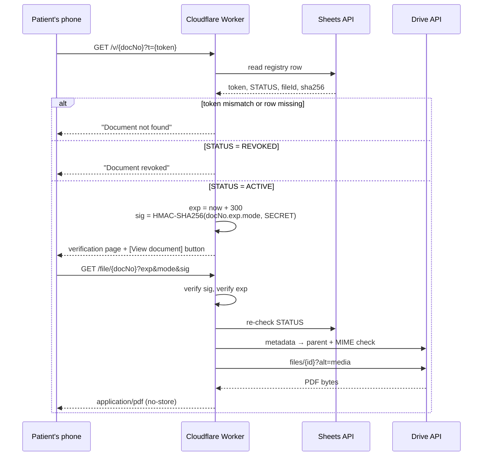

# VivaMed QR Document Verification

> Tamper-evident QR verification for clinical PDF documents — Google Workspace Add-on for issuing, Cloudflare Worker for public verification, and a private PDF gateway that never exposes a Google Drive link.

[](https://github.com/Mardonaka05/vivamed-qr-verification/actions/workflows/ci.yml)
[](https://developers.google.com/apps-script)
[](https://workers.cloudflare.com/)
[](#)
[](LICENSE)

🇺🇿 [O'zbekcha versiya](README.uz.md) · 📚 [Full technical docs](docs/en/) · 📖 [Texnik kitoblar (uz)](docs/uz/)

---

## The problem

A clinic issues paper documents — certificates, referrals, reports. Anyone can retype one in Word and print it. There is no way for the receiving party to tell a real document from a forged one, and no way for the clinic to invalidate a document it issued by mistake.

The obvious fix — print a QR code that opens the PDF — creates three new problems:

| Naive approach | What goes wrong |
| --- | --- |
| QR → `drive.google.com/file/...` | The PDF must be shared "anyone with the link". That link leaks, gets indexed, and lives forever. |
| QR → `script.google.com/macros/s/...` | The verification page lives on a domain anyone can publish to. A forger builds a look-alike page on the same domain and the QR "proves" nothing. |
| QR → sequential document number | `...000012` → change to `...000013` and you enumerate every patient's document. |

This system exists to solve all three at once.

## The solution in one paragraph

Documents are issued from inside Google Drive by a Workspace Add-on: the manager approves a file, the system reserves a sequential document number plus a random token, stamps a QR code onto the PDF, stores it in a **Restricted** Drive folder and writes a registry row with the file's SHA-256 fingerprint. Verification happens somewhere else entirely — the QR points at the clinic's **own domain**, served by a Cloudflare Worker. The Worker reads the registry through a read-only Service Account, checks `docNo + token + STATUS`, and if the document is `ACTIVE`, mints a **5-minute HMAC-signed URL** to a `/file/` gateway that streams the PDF out of private Drive storage under the clinic's domain. The browser never sees Google Drive. A revoked document stops verifying on the very next scan.

## Architecture



Two faces, one system. The add-on writes and runs as the employee. The Worker only reads, runs anonymously, and holds a read-only Google identity. Neither can do the other's job.

### Verification flow



Note the two independent checks of `STATUS`. A signed link that is still inside its 5-minute window is refused the moment the document is revoked.

## Security model

Thirteen layers, none of which is a password:

| # | Layer | What it stops |
| --- | --- | --- |
| 1 | HTTPS/TLS | Traffic interception between phone and edge |
| 2 | Hostname allowlist | `*.workers.dev` returns 404 — only the official domain is a valid entry point |
| 3 | `docNo` + 96-bit token | URL enumeration of other patients' documents |
| 4 | Real-time `STATUS` | A revoked document keeps its QR but stops verifying |
| 5 | Read-only Service Account | The public backend cannot delete, edit or re-share anything |
| 6 | Secrets outside code | Credentials live in Cloudflare Secrets, never in the repo |
| 7 | 5-minute expiry | A shared PDF URL dies quickly |
| 8 | HMAC-SHA256 signature | `exp`, `mode` and `docNo` cannot be edited by hand |
| 9 | `STATUS` re-check at `/file/` | Revocation beats a still-valid signed link |
| 10 | Approved-parent check | A stolen Drive file ID cannot be streamed through the gateway |
| 11 | MIME check | Only `application/pdf` is ever served |
| 12 | Restricted Drive | No "anyone with the link" permission exists to leak |
| 13 | Security headers | `no-store`, `nosniff`, `no-referrer`, frame deny |

Detailed reasoning, including what this design deliberately does **not** protect against (QR cloning onto forged paper), is in [`docs/en/02-security-model.md`](docs/en/02-security-model.md).

### The signed ticket

```
message = docNo + "." + exp + "." + mode
sig     = HMAC-SHA256(message, FILE_TICKET_SECRET)
exp     = now + 300
```

Stateless by design — nothing is stored server-side, so nothing has to be cleaned up. Editing `exp` in the address bar invalidates `sig`, and forging a new `sig` requires the secret.

## Repository layout

```
.
├── apps-script/          Google Workspace Add-on — the write side
│   ├── Config.gs           settings gateway (Sheets key/value + cache)
│   ├── Registry.gs         document numbers, tokens, lookup, revoke
│   ├── PdfStamp.gs         pdf-lib in a synchronous runtime
│   ├── Code.gs             cards, approval flow, format conversion
│   ├── WebApp.gs           legacy Apps Script verification endpoint
│   ├── Verify.html         legacy verification page
│   └── appsscript.json     manifest: scopes, add-on triggers, allowlist
├── worker/               Cloudflare Worker — the public read side
│   └── src/worker.js       /v/ verification + /file/ private PDF gateway
├── docs/
│   ├── en/                 technical documentation (English)
│   └── uz/                 original technical books (Uzbek)
└── README.md
```

## Engineering notes

Three problems in this project were harder than they looked.

**Promises in a synchronous runtime.** Apps Script is synchronous; `pdf-lib` is built on Promises. A card-returning add-on function cannot be `async`, so `pdf.save().then(...)` never resolves before the function returns. The fix is a `SyncPromise` that executes `.then` immediately, swapped in as the global `Promise` while the library is loaded and swapped back after. It works precisely because `pdf-lib` never actually waits on I/O — this is a targeted solution, not a general one.

**Signed vs. unsigned bytes.** `Blob.getBytes()` returns signed bytes (−128…127); `pdf-lib` expects `Uint8Array` (0…255). Get the conversion wrong in either direction and the PDF is silently corrupted — no exception, the file just refuses to open.

**Number reservation before the slow work.** Stamping a PDF takes 10–30 seconds. If the document number were assigned at the end, two managers approving at the same time would both read "last number = 21" and both get 22. So the number and token are reserved first, under a `LockService` lock held for ~0.3 s, and the heavy work runs unlocked.

The full reasoning per file — including the known weak points and the order in which they should be fixed — is in [`docs/en/05-apps-script-modules.md`](docs/en/05-apps-script-modules.md) and [`docs/en/07-known-issues.md`](docs/en/07-known-issues.md).

## Status

Production-ready core; deployed for a clinic in Tashkent. Verified in testing:

- Restricted PDF served through the custom domain — Drive URL never exposed
- Expired `/file/` link rejected after 5 minutes
- Wrong token → "Document not found", with no hint that the document exists
- `workers.dev` host → 404
- `REVOKED` document → blocked at both `/v/` and `/file/`
- Legacy migration: 8 files checked, 6 public permissions removed, 0 errors

- One high-severity issue is still open: a document can be approved twice if the archive move fails, which would put one document in the registry under two numbers. It is written up, with the fix, in [`docs/en/07-known-issues.md`](docs/en/07-known-issues.md).

## Setup

See [`docs/en/06-deployment.md`](docs/en/06-deployment.md) for the full walkthrough: Google Cloud project and Service Account, Shared Drive folder structure, registry spreadsheet, Apps Script deployment, DNS delegation and the Worker custom domain.

Worker configuration:

| Variable | Type | Purpose |
| --- | --- | --- |
| `GOOGLE_SHEETS_ID` | text | Which registry to read |
| `APPROVED_FOLDER_ID` | text | Which Drive folder is authoritative |
| `GCP_SERVICE_ACCOUNT_JSON` | secret | Service Account credential for OAuth |
| `FILE_TICKET_SECRET` | secret | HMAC key for 5-minute PDF links |

No secret is committed to this repository, and none is required to read the code.

## License

MIT — see [LICENSE](LICENSE).

---

**Mardonbek Sulaymonqulov** · AI / Computer Vision Engineer, Tashkent
[GitHub](https://github.com/Mardonaka05) · mardonbeksulaymonqulov156@gmail.com
