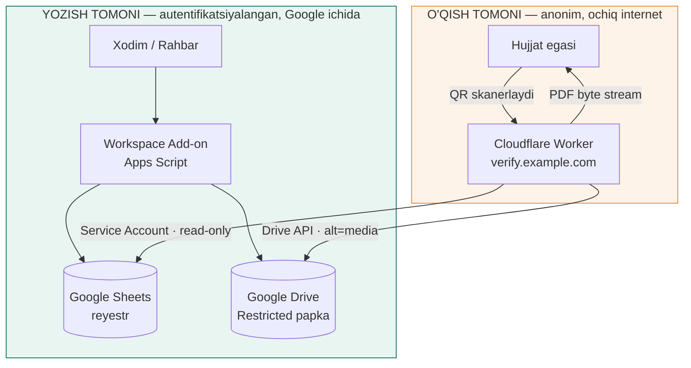
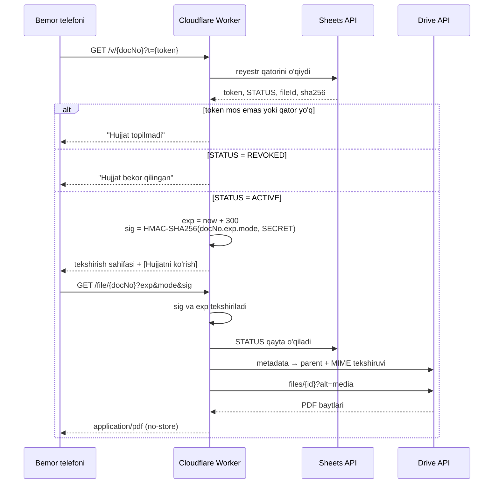

# VivaMed QR Hujjat Verifikatsiyasi

> Tibbiy PDF hujjatlarni QR orqali tekshirish tizimi — hujjat chiqarish uchun Google Workspace Add-on, ommaviy tekshirish uchun Cloudflare Worker va Google Drive havolasini umuman ko'rsatmaydigan private PDF gateway.

🇬🇧 [English version](README.md) · 📚 [Texnik kitoblar](docs/uz/) · 📖 [Technical docs (en)](docs/en/)

---

## Muammo

Klinika qog'oz hujjat beradi — ma'lumotnoma, yo'llanma, xulosa. Uni Word'da qaytadan yozib chiqarish hech kimga qiyin emas. Hujjatni qabul qilgan tomon haqiqiysini soxtasidan ajrata olmaydi, klinika esa xato chiqib ketgan hujjatni bekor qila olmaydi.

Eng oddiy yechim — PDF'ni ochadigan QR-kod chop etish — o'rniga uchta yangi muammo tug'diradi:

| Sodda yondashuv | Nima noto'g'ri ketadi |
| --- | --- |
| QR → `drive.google.com/file/...` | PDF "havolaga ega har kim" holatida bo'lishi shart. Bu havola tarqaladi, indekslanadi va abadiy yashaydi. |
| QR → `script.google.com/macros/s/...` | Tekshirish sahifasi har kim nashr qila oladigan domenda turadi. Soxtalashtiruvchi o'sha domenda o'xshash sahifa yasaydi va QR hech narsani isbotlamay qoladi. |
| QR → ketma-ket hujjat raqami | `...000012` → `...000013` deb o'zgartirasiz va barcha bemorlarning hujjatlarini terib chiqasiz. |

Bu tizim uchalasini bir vaqtda yechish uchun qurilgan.

## Yechim — bir xatboshida

Hujjat Google Drive ichidan, Workspace Add-on orqali chiqariladi: rahbar faylni tasdiqlaydi, tizim ketma-ket hujjat raqami va tasodifiy token band qiladi, PDF ustiga QR-kod bosadi, uni **Restricted** Drive papkasiga saqlaydi va reyestrga faylning SHA-256 barmoq izi bilan qator yozadi. Tekshirish esa butunlay boshqa joyda bo'ladi — QR klinikaning **o'z domeniga** ishora qiladi va uni Cloudflare Worker xizmat qiladi. Worker read-only Service Account orqali reyestrni o'qiydi, `docNo + token + STATUS` ni tekshiradi va hujjat `ACTIVE` bo'lsa, **5 daqiqalik HMAC bilan imzolangan** `/file/` havolasini yaratadi — u PDF'ni private Drive ombordan olib, klinika domeni ostida uzatadi. Brauzer Google Drive'ni umuman ko'rmaydi. Bekor qilingan hujjat esa keyingi skanda darhol ishlamay qoladi.

## Arxitektura



Bitta tanada ikkita yuz. Add-on yozadi va xodim nomidan ishlaydi. Worker faqat o'qiydi, anonim ishlaydi va Google ichida read-only identifikatorga ega. Biri ikkinchisining ishini qila olmaydi.

### Tekshirish oqimi



`STATUS` ikki marta, mustaqil ravishda tekshirilishiga e'tibor bering. 5 daqiqalik oynasi hali tugamagan imzolangan havola ham, hujjat bekor qilingan zahoti rad etiladi.

## Xavfsizlik modeli

O'n uchta qatlam — va ularning hech biri parol emas:

| # | Qatlam | Nimani to'sadi |
| --- | --- | --- |
| 1 | HTTPS/TLS | Telefon ↔ edge orasidagi trafikni ushlab qolish |
| 2 | Hostname cheklovi | `*.workers.dev` 404 qaytaradi — faqat rasmiy domen kirish nuqtasi |
| 3 | `docNo` + 96-bitli token | Boshqa bemorlar hujjatlarini URL orqali terib chiqish |
| 4 | Real vaqtdagi `STATUS` | Bekor qilingan hujjat QR'ini saqlaydi, lekin tekshiruvdan o'tmaydi |
| 5 | Read-only Service Account | Ommaviy backend hech narsani o'chira, tahrirlay yoki qayta ulasha olmaydi |
| 6 | Sirlar koddan tashqarida | Credential'lar Cloudflare Secret'da, repoda emas |
| 7 | 5 daqiqalik muddat | Tarqalib ketgan PDF havolasi tez o'ladi |
| 8 | HMAC-SHA256 imzo | `exp`, `mode` va `docNo` ni qo'lda o'zgartirib bo'lmaydi |
| 9 | `/file/` da `STATUS` qayta tekshiruvi | Bekor qilish hali tirik imzolangan havoladan ustun |
| 10 | Approved-parent tekshiruvi | O'g'irlangan Drive File ID gateway orqali o'tmaydi |
| 11 | MIME tekshiruvi | Faqat `application/pdf` uzatiladi |
| 12 | Restricted Drive | Tarqaladigan "havolaga ega har kim" ruxsati umuman yo'q |
| 13 | Security header'lar | `no-store`, `nosniff`, `no-referrer`, frame deny |

To'liq mulohazalar — jumladan bu dizayn **ataylab himoya qilmaydigan** narsa (QR-ni soxta qog'ozga nusxalash) — [`docs/uz/`](docs/uz/) ichidagi kitoblarda.

### Imzolangan chipta

```
message = docNo + "." + exp + "." + mode
sig     = HMAC-SHA256(message, FILE_TICKET_SECRET)
exp     = now + 300
```

Ataylab stateless: server tomonda hech narsa saqlanmaydi, demak hech narsani tozalash ham kerak emas. Manzil qatoridagi `exp` ni o'zgartirsangiz `sig` yaroqsiz bo'ladi, yangi to'g'ri `sig` yasash uchun esa secret kerak.

## Repo tuzilishi

```
.
├── apps-script/          Google Workspace Add-on — yozish tomoni
│   ├── Config.gs           sozlamalar darvozasi (Sheets kalit/qiymat + kesh)
│   ├── Registry.gs         hujjat raqamlari, tokenlar, qidiruv, revoke
│   ├── PdfStamp.gs         sinxron muhitda pdf-lib
│   ├── Code.gs             kartalar, tasdiqlash oqimi, format o'girish
│   ├── WebApp.gs           eski Apps Script tekshirish endpointi
│   ├── Verify.html         eski tekshirish sahifasi
│   └── appsscript.json     manifest: scope'lar, add-on triggerlari, allowlist
├── worker/               Cloudflare Worker — ommaviy o'qish tomoni
│   └── src/worker.js       /v/ tekshirish + /file/ private PDF gateway
├── docs/
│   ├── en/                 texnik hujjatlar (inglizcha)
│   └── uz/                 asl texnik kitoblar (o'zbekcha)
└── README.md
```

## Muhandislik eslatmalari

Bu loyihada uchta masala ko'ringanidan qiyinroq bo'lib chiqdi.

**Sinxron muhitda Promise.** Apps Script sinxron, `pdf-lib` esa Promise ustiga qurilgan. Card qaytaradigan add-on funksiyasini `async` qilib bo'lmaydi, shuning uchun `pdf.save().then(...)` funksiya tugagunicha hech qachon bajarilmaydi. Yechim — `.then` ni darhol bajaradigan `SyncPromise`: kutubxona yuklanayotganda global `Promise` almashtiriladi, keyin qaytariladi. Bu ishlaydi, chunki `pdf-lib` ichida haqiqiy I/O kutish yo'q — ya'ni yechim universal emas, aynan shu kutubxonaga mos.

**Ishorali va ishorasiz baytlar.** `Blob.getBytes()` ishorali baytlar qaytaradi (−128…127), `pdf-lib` esa `Uint8Array` kutadi (0…255). Ikki yo'nalishning birida o'girish unutilsa, PDF jimgina buziladi — xato chiqmaydi, fayl shunchaki ochilmaydi.

**Raqamni og'ir ishdan oldin band qilish.** PDF'ni ishlash 10–30 soniya. Agar raqam oxirida berilsa, bir vaqtda tasdiqlagan ikki rahbar ham "oxirgi raqam 21" ni ko'radi va ikkalasi ham 22 ni oladi. Shuning uchun raqam va token birinchi bo'lib, `LockService` qulfi ostida ~0.3 soniyada band qilinadi, og'ir ish esa qulfsiz ketadi.

Har bir fayl bo'yicha to'liq mulohaza — zaif nuqtalar va ularni tuzatish tartibi bilan — [`docs/uz/06-kod-arxitekturasi.md`](docs/uz/06-kod-arxitekturasi.md) da.

## Holat

Asosiy qism production-ready; Toshkentdagi klinikada ishlatilmoqda. Testda tasdiqlangan:

- Restricted PDF custom domen orqali ochildi — Drive URL hech qachon ko'rinmadi
- Muddati tugagan `/file/` havolasi 5 daqiqadan keyin rad etildi
- Noto'g'ri token → "Hujjat topilmadi", hujjat mavjudligiga ishora ham bermaydi
- `workers.dev` host → 404
- `REVOKED` hujjat → `/v/` da ham, `/file/` da ham bloklandi
- Eski fayllar migratsiyasi: 8 fayl tekshirildi, 6 public ruxsat olib tashlandi, 0 xato

## O'rnatish

To'liq yo'riqnoma: [`docs/en/06-deployment.md`](docs/en/06-deployment.md) — Google Cloud loyihasi va Service Account, Shared Drive papka tuzilmasi, reyestr jadvali, Apps Script deploy, DNS delegatsiyasi va Worker custom domain.

Worker sozlamalari:

| O'zgaruvchi | Turi | Vazifasi |
| --- | --- | --- |
| `GOOGLE_SHEETS_ID` | text | Qaysi reyestr o'qiladi |
| `APPROVED_FOLDER_ID` | text | Qaysi Drive papka rasmiy hisoblanadi |
| `GCP_SERVICE_ACCOUNT_JSON` | secret | OAuth uchun Service Account credential |
| `FILE_TICKET_SECRET` | secret | 5 daqiqalik PDF havolalari uchun HMAC kaliti |

Bu repoda birorta ham secret yo'q, kodni o'qish uchun ular kerak ham emas.

## Litsenziya

MIT — [LICENSE](LICENSE) ga qarang.

---

**Mardonbek Sulaymonqulov** · AI / Computer Vision Engineer, Toshkent
[GitHub](https://github.com/Mardonaka05) · mardonbeksulaymonqulov156@gmail.com
