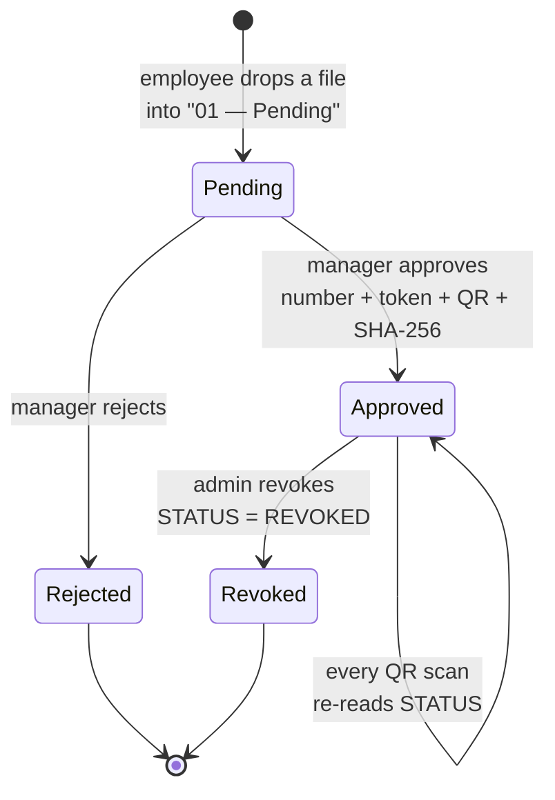
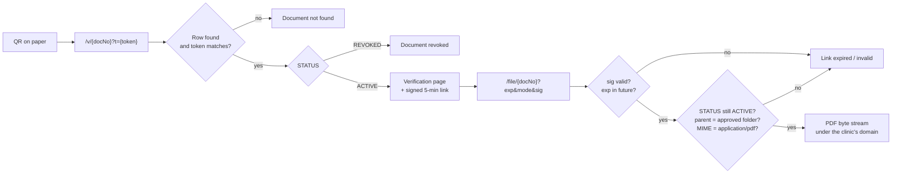

# 01 · Architecture

## Why the system is split in two

The single decision that shapes everything else: **the party that issues documents and the party that verifies them must not share a code path, an identity, or a set of permissions.**

Issuing needs write access to Drive and Sheets, and happens inside an authenticated Google session. Verification is done by strangers — a patient, a school registrar, another clinic — with no account, no login, and no reason to trust anything the clinic hands them except the clinic's own domain.

So the system has two faces:

| | Write side (Add-on) | Read side (Worker) |
| --- | --- | --- |
| Runs where | Google Apps Script | Cloudflare edge |
| Triggered by | Employee or manager, in Drive | Anyone, by scanning a QR |
| Runs as | The signed-in user | An anonymous request + a read-only Service Account |
| Can do | Read and write | Read only |
| Entry points | Many — one per button | Two — `/v/` and `/file/` |
| Login | Required | Never |

The public surface is deliberately tiny. Two routes, both read-only, neither of which can list anything. Security here is not built on a password; it is built on how little the public face is able to do.

## Components

| Component | Role |
| --- | --- |
| Google Workspace Add-on (Apps Script) | Approval flow, QR stamping, registry writes, revocation |
| Google Sheets | The registry — the single source of truth for `docNo`, `token`, `fileId`, `STATUS`, `SHA-256` |
| Google Drive (Shared Drive) | Private storage for approved PDFs and archived originals |
| Google Cloud project | Container for the enabled APIs and the Service Account |
| Service Account | The Worker's technical identity inside Google — Viewer, read-only scopes |
| Cloudflare DNS | Authoritative zone for the clinic's domain |
| Cloudflare Worker | The entire public backend: verification page + private PDF gateway |
| `verify.example.com` | The official hostname users see; a Custom Domain bound to the Worker |

Google Cloud does not store any document. It exists only so a non-Google server can prove who it is when calling Google APIs.

## Document lifecycle



There is no "status" field in Google Drive, so **the folder is the state**. A file's physical location is its status, which means dropping a file into the pending folder *is* the request — no form, no button, no separate notification. It also splits duties cleanly: the employee uploads, the manager approves, and the registry records both names.

```
Shared Drive: "VivaMed Documents"
├── 01 — Pending        awaiting approval        (employee writes here)
├── 02 — Approved       issued, numbered, QR     (Restricted; Service Account = Viewer)
└── 03 — Archive        originals and rejects    (evidence copy, never modified)
```

The source file is never modified. A Word document goes into the archive byte-identical, because the original serves as evidence; the QR-stamped PDF is a new file, and the registry's source-file-ID column points back at the original.

## Approval — eleven steps, one execution

An add-on invocation must return a `Card` object. It cannot be `async`, cannot show a spinner, and cannot be split across calls. Everything below happens inside a single execution:

| # | Step | Component | Typical time |
| --- | --- | --- | --- |
| 1 | Read settings | `Config` → Sheets | ~0.5 s |
| 2 | **Reserve number + token — under lock** | `Registry.reserve()` → Sheets | ~0.3 s |
| 3 | Build the verification URL | `Code.gs` | — |
| 4 | Convert the document to PDF bytes | Drive | 2–10 s |
| 5 | Fetch the QR image — external | QR service | ~1 s |
| 6 | Load `pdf-lib` — external | unpkg CDN | 1–2 s |
| 7 | Draw the QR and signature line | `PdfStamp.stamp()` | 2–15 s |
| 8 | Save the new PDF to the approved folder | Drive | ~1 s |
| 9 | Compute SHA-256 and write the fingerprint | `Code.gs` | ~0.5 s |
| 10 | Fill the registry row | `Registry.fill()` → Sheets | ~0.5 s |
| 11 | Move the original to the archive | Drive | ~1 s |

Step 2 comes before the expensive work on purpose. If the number were assigned last, two managers approving simultaneously would both read the same "last number" and both receive it — two different documents sharing one identity, which for a medical registry is a correctness failure, not an inconvenience.

Step 9 comes before step 10 so the registry only ever contains documents that actually exist. Step 11 last, so a failure anywhere earlier leaves the source file exactly where it was.

## Format handling

The add-on accepts more than PDFs. Three paths, one output:

```
PDF                                   → bytes used directly
Google Docs / Sheets / Slides         → getAs(PDF)
Word / Excel / PowerPoint / RTF       → temporary Google copy → getAs(PDF) → copy deleted
CSV / ODT / ODS / ODP                 → getAs(PDF)
```

Temporary Google copies are removed in a `finally` block, so an interrupted run does not leave debris accumulating in Drive.

## Verification — end to end



The first URL does not *become* the second one. The Worker computes a fresh signed URL on every verification and places it in the page's button `href`. Nothing is stored: the ticket is stateless, all public parameters live in the URL, and the secret stays in Cloudflare.

## What the QR actually proves

This matters, and it is easy to overstate.

A QR code can be photographed off a genuine document and glued onto a forged one. No server-side check can detect that, because the request the server sees is identical. So the honest claim is **not** "this paper is real because it has a QR".

The correct model: the QR leads to the canonical record on the clinic's own server. The verification page shows the document number, type, issue date and signer, and offers the original PDF. The person holding the paper compares the two. Verification is a *comparison tool*, not a stamp of authenticity — and the page is designed to make that comparison easy.
