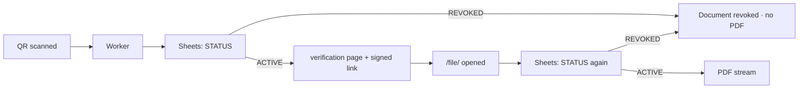
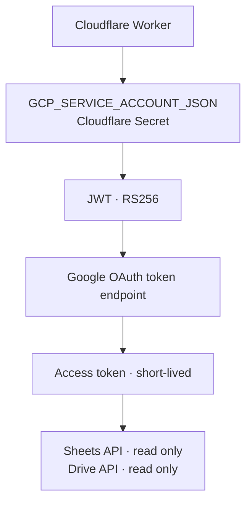

# 02 · Security model

## Design principle

There is no password anywhere in the public path. The protection comes from three properties instead:

1. **A tiny public surface.** Two read-only routes. Neither lists, searches, or enumerates.
2. **Unguessable identifiers.** A document number alone is never enough.
3. **Short-lived, signed capabilities.** Access to a PDF is a 5-minute ticket, not a permanent URL.

Anything that grants access is either derived from a secret the client never sees, or checked again on every single request.

## The thirteen layers

| # | Layer | Implemented where | What it stops |
| --- | --- | --- | --- |
| 1 | HTTPS/TLS | Cloudflare edge | Interception between the phone and the edge |
| 2 | Hostname allowlist | Worker, first lines | Access through `*.workers.dev` or any host but the official one |
| 3 | `docNo` + token | Worker `/v/`, registry lookup | Enumeration by incrementing the document number |
| 4 | Real-time `STATUS` | Sheets read on every request | A revoked document continuing to verify |
| 5 | Read-only Service Account | Google IAM + OAuth scopes | The public backend modifying, deleting or re-sharing anything |
| 6 | Secrets outside code | Cloudflare Secrets | Credentials leaking through the repository or the editor |
| 7 | 5-minute expiry | `exp` in the signed ticket | A forwarded PDF link working forever |
| 8 | HMAC-SHA256 signature | `sig` in the signed ticket | Hand-editing `exp`, `mode` or `docNo` |
| 9 | `STATUS` re-check | Worker `/file/` | A live signed link outliving a revocation |
| 10 | Approved-parent check | Drive metadata check | A stolen or guessed Drive file ID being streamed |
| 11 | MIME check | Drive metadata check | Anything that is not `application/pdf` being served |
| 12 | Restricted Drive | Drive sharing settings | The "anyone with the link" permission existing at all |
| 13 | Security headers | Worker responses | Caching, framing, referrer leakage, MIME sniffing |

## Layer 2 — why the hostname check exists

Every Worker also answers on a `*.workers.dev` address that Cloudflare assigns automatically. That address is real, routable, and not the clinic's brand. Leaving it live would mean two valid entry points, one of which no one can visually verify.

```js
if (url.hostname !== OFFICIAL_HOST) {
  return new Response("Not Found", { status: 404 });
}
```

Result: the official hostname works, the technical one is indistinguishable from a nonexistent site.

## Layer 3 — the token

Document numbers are sequential and meant to be: they are useful in reports and archives, and they get printed on the document. Sequential numbers are also trivially enumerable, so the number alone never grants access.

```js
Utilities.getUuid().replace(/-/g, "").substring(0, 24)
// → "a3f9c21b8e04d7c1f0b25e93" — 24 hex chars = 96 bits
```

The token is stored in the registry and embedded in the QR URL, but it is **never drawn onto the document**. Reading a printed document does not reveal it; only scanning the QR does.

A related discipline: the lookup must **fail closed**.

```js
if (!storedToken || storedToken !== suppliedToken) return null;
```

Written the other way round — `if (storedToken && storedToken !== supplied)` — a blank token cell would *disable* the check for that row instead of denying it, and clearing column J would silently make every document enumerable by number. Both the add-on and the Worker use the fail-closed form; the Worker additionally compares in constant time.

## Layer 4 and 9 — revocation that actually revokes

A QR code is ink. It cannot be recalled, and it carries no state — it is a fixed URL. So revocation cannot work by changing the QR; it works by changing what the server says about it.



The second check is the one people forget. Without it, a signed link minted 30 seconds before revocation would keep serving the PDF for another 4½ minutes.

## Layers 7 and 8 — the signed ticket

```
exp     = now + 300                              (Unix seconds)
message = docNo + "." + exp + "." + mode         (mode ∈ {view, download})
sig     = HMAC-SHA256(message, FILE_TICKET_SECRET)

/file/{docNo}?exp={exp}&mode={mode}&sig={sig}
```

Properties worth stating explicitly:

- **Stateless.** No ticket table, no cleanup job, no storage to compromise. Everything public is in the URL; the only secret stays in Cloudflare.
- **Tamper-evident.** `exp` is inside the signed message, so extending the deadline invalidates the signature. Producing a new valid `sig` requires `FILE_TICKET_SECRET`.
- **Not a status.** The 5 minutes apply to the *link*, not the document. Scanning the QR again yields a fresh `exp` and a fresh `sig`.

Validation order at `/file/`, cheapest checks first:

1. `exp` present and an integer
2. `exp` not in the past
3. `exp` not absurdly far in the future
4. `mode` ∈ {`view`, `download`}
5. `sig` matches the recomputed HMAC
6. Registry re-read → `STATUS = ACTIVE`
7. Drive metadata → parent includes the approved folder
8. Drive metadata → MIME is `application/pdf`
9. Only then: `files/{fileId}?alt=media`

## Layer 5 — the Service Account is deliberately weak

The Worker's Google identity is added as **Viewer** on exactly two resources: the registry spreadsheet and the approved folder. Its OAuth scopes are `spreadsheets.readonly` and `drive.readonly`. It holds no project-level Owner or Editor role.

This means the worst case for a fully compromised Worker is *disclosure of approved documents*, not modification of the registry, deletion of files, or re-sharing anything publicly. The write side stays with the add-on, which requires a signed-in employee.



## Error responses leak nothing

Every failure on the public side resolves to one of two messages: *document not found* or *link expired*. A wrong token, a missing row, a broken spreadsheet, an unreadable sheet — all indistinguishable from outside.

This is deliberate. Telling a stranger "the token is wrong" also tells them the document number exists.

## What this system does not protect against

**QR cloning / replay.** A genuine QR photographed and printed on a forged sheet produces a request identical to the real one. No server check distinguishes them.

The mitigation is presentational, not cryptographic: the verification page shows the document number, type, issue date, issuing organisation and signer, and links to the original PDF. Anyone holding a paper is expected to compare it against the canonical record. The stronger the page's presentation of the real content, the smaller the value of a cloned QR.

**Registry integrity by insiders.** Anyone with edit rights on the spreadsheet can delete a row and silently "kill" a valid document, or blank a token. Protected ranges on the `Registry` and `Settings` sheets are the mitigation and take five minutes to configure.

**Personal data on the verification page.** If file names contain patient, ward or diagnosis information, showing the file name on a publicly reachable page discloses it. The page needs the document number, date and organisation — nothing more. See [known issues](07-known-issues.md#6--verification-page-shows-the-file-name).

## Key rotation

Service Account key:

1. Create a new key in Google Cloud.
2. Replace `GCP_SERVICE_ACCOUNT_JSON` in Cloudflare Secrets.
3. Test verification end to end.
4. Only after the new key is confirmed working, delete the old key in Google Cloud.

`FILE_TICKET_SECRET`: rotate to a new random value. Every previously issued signed link becomes invalid immediately — which is the point, and is harmless, because links are re-minted on every scan.
